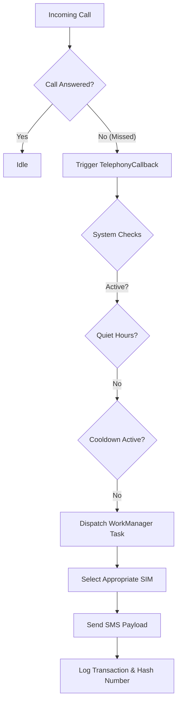

<div align="center">
  

  # Adera SMS
  
  **Enterprise-Grade Automated Missed Call Engagement**
  
  <p align="center">
    <a href="https://github.com/miftah-ab/adera-sms/releases/latest"></a>
    <a href="https://github.com/miftah-ab/adera-sms/actions/workflows/build.yml"></a>
    <a href="https://android.com"></a>
    <a href="https://kotlinlang.org"></a>
    <a href="https://github.com/miftah-ab/adera-sms/blob/main/LICENSE"></a>
  </p>

  *"Transform missed connections into guaranteed opportunities."*

  [**Download Latest APK**](https://github.com/miftah-ab/adera-sms/releases/latest) •
  [**Documentation**](#-documentation) •
  [**Report a Bug**](https://github.com/miftah-ab/adera-sms/issues) •
  [**Request Feature**](https://github.com/miftah-ab/adera-sms/issues)
</div>

---

## 🌍 Overview

**Adera SMS** is a resilient, offline-first automated messaging platform engineered for seamless communication reliability. Originally developed to conquer the unique connectivity challenges of emerging markets, Adera SMS provides enterprise-grade auto-reply capabilities to individual professionals and businesses operating in any environment.

By instantly triggering customizable SMS replies upon missed calls, Adera SMS ensures zero loss of leads or critical communications.

---

## ✨ Enterprise-Grade Features

- **⚡ Instant Automation:** Zero-latency SMS dispatch immediately upon detecting a missed call.
- **📱 Multi-SIM Intelligence:** Native support and intelligent routing for dual-SIM devices (Tecno, Infinix, Itel, Samsung, Xiaomi).
- **🔒 Privacy by Design:** 100% local processing. Phone numbers are securely hashed (SHA-256) and never stored in plain text or transmitted.
- **🔋 Extreme Battery Efficiency:** Optimized background processing via WorkManager ensures zero battery drain, circumventing aggressive OEM battery killers.
- **⏰ Smart Quiet Hours:** Configurable "Do Not Disturb" scheduling with overnight range support (e.g. 22:00 to 07:00).
- **🔄 Intelligent Cooldowns:** Built-in anti-spam algorithms prevent duplicate messaging to the same caller within a defined 10-minute timeframe.
- **🌐 Zero Dependency:** Fully offline execution requiring no internet connection, external servers, or cloud synchronization.

---

## 📸 Interface Gallery

> *Our user interface is designed with Google's Material Design 3 principles for an intuitive, accessible experience.*

| Dashboard | Configuration | Analytics Log |
|:---:|:---:|:---:|
| *Centralized control hub* | *Comprehensive rule sets* | *Granular interaction history* |

*(Screenshots to be attached in future releases)*

---

## 🏗 Architecture & Infrastructure

Adera SMS utilizes a modern, robust Android architecture designed for scalability, testability, and uncompromising reliability.

### Core Technology Stack

* **Language:** Kotlin (100% pure)
* **UI Framework:** Jetpack Compose & Material 3
* **Persistence:** Room Persistence Library (SQLite)
* **Background Processing:** Android Jetpack WorkManager
* **Telephony Intercept:** Modern `TelephonyCallback` with legacy `PhoneStateListener` fallbacks
* **CI/CD:** Fully automated via GitHub Actions

### System Design Workflow



---

## 🚀 Quick Start & Deployment

### Installation

1. Navigate to our [Releases Page](https://github.com/miftah-ab/adera-sms/releases/latest).
2. Download the latest `app-release.apk`.
3. Enable **Install from Unknown Sources** in your Android device settings.
4. Execute the APK and grant the requested baseline permissions.

### Build from Source

For enterprise integration or custom deployment, Adera SMS can be built directly from source:

```bash
# Clone the repository
git clone https://github.com/miftah-ab/adera-sms.git
cd adera-sms

# Build the debug APK
./gradlew assembleDebug

# Install on connected physical device
./gradlew installDebug
```
*Note: Telephony events require testing on physical hardware. Emulators are unsupported for this specific workflow.*

---

## 🛡️ Security & Compliance

At Adera SMS, data integrity and user privacy are foundational.

* **No Cloud Storage:** We do not operate databases; your data never leaves your device.
* **Cryptographic Hashing:** Identifiable metadata (like phone numbers) are irreversibly hashed using SHA-256 for cooldown processing.
* **Zero Telemetry:** The application contains zero tracking SDKs and transmits zero analytics telemetry.

---

## 🤝 Open Source & Enterprise Support

Adera SMS is proudly open-source. We welcome contributions from developers worldwide to improve global communication access.

* **Bug Reports & Feature Requests:** Please use our [Issue Tracker](https://github.com/miftah-ab/adera-sms/issues).
* **Code Contributions:** Fork the repository, create a feature branch, and submit a Pull Request. Please adhere to the official Kotlin Style Guide.

---

## 📄 License

This software is released under the **MIT License**.

```text
Copyright (c) 2026 Miftah

Permission is hereby granted, free of charge, to any person obtaining a copy
of this software and associated documentation files (the "Software"), to deal
in the Software without restriction, including without limitation the rights
to use, copy, modify, merge, publish, distribute, sublicense, and/or sell
copies of the Software, and to permit persons to whom the Software is
furnished to do so, subject to the following conditions:

The above copyright notice and this permission notice shall be included in all
copies or substantial portions of the Software.

THE SOFTWARE IS PROVIDED "AS IS", WITHOUT WARRANTY OF ANY KIND, EXPRESS OR
IMPLIED, INCLUDING BUT NOT LIMITED TO THE WARRANTIES OF MERCHANTABILITY,
FITNESS FOR A PARTICULAR PURPOSE AND NONINFRINGEMENT. IN NO EVENT SHALL THE
AUTHORS OR COPYRIGHT HOLDERS BE LIABLE FOR ANY CLAIM, DAMAGES OR OTHER
LIABILITY, WHETHER IN AN ACTION OF CONTRACT, TORT OR OTHERWISE, ARISING FROM,
OUT OF OR IN CONNECTION WITH THE SOFTWARE OR THE USE OR OTHER DEALINGS IN THE
SOFTWARE.
```

---
<div align="center">
  <b>Built with precision for uncompromised reliability.</b><br>
  © 2026 Adera SMS Technologies. All rights reserved.
</div>
